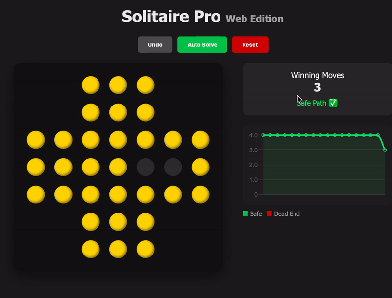
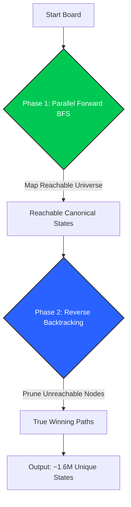
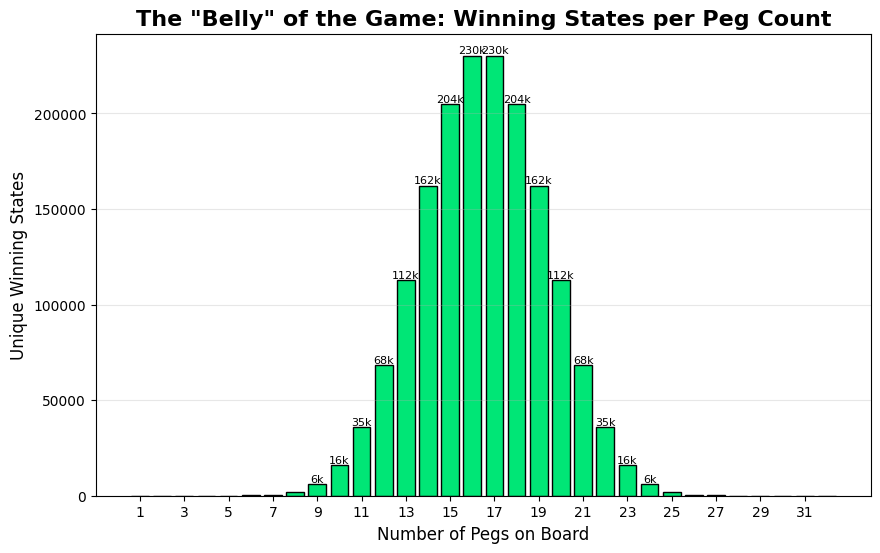
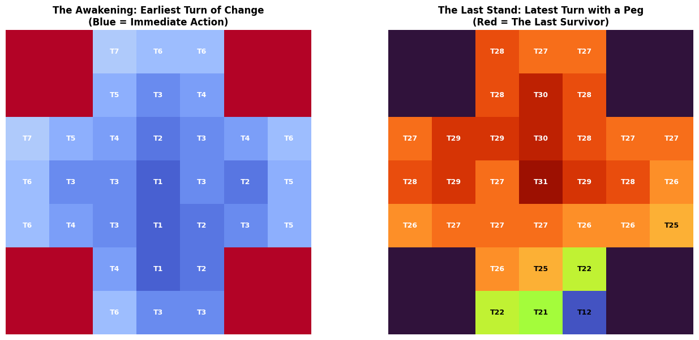
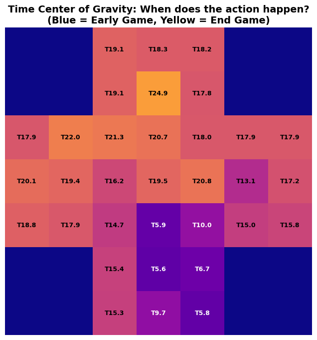

# Machshevet (Peg Solitaire) Oracle

> **A high-performance Hybrid-BFS Oracle comprising ~1.6 million unique winning states distilled from over 187 million raw possibilities.**


Most Peg Solitaire solvers are simple recursive backtracking scripts that find *one* solution. **This is not that.**

This project is a mathematical "Oracle" for the Standard English Board (33 holes). It doesn't just "solve" the game; it maps the entire universe of valid gameplay. It knows exactly how many winning paths exist from your current state, and it knows the moment you've made a fatal mistake—often 15 moves before the game actually ends.

**Play online:** [https://hrsi56.pythonanywhere.com](https://hrsi56.pythonanywhere.com)



---

## The Story of Failure (And How We Fixed It)

This wasn't a straight line to a solution. It was a series of humbling failures.

### Phase 1: The AI Overkill (Failure)
Like many engineers, my first instinct was "let's train a model." We implemented **AlphaZero** with MCTS and reward shaping using Pagoda functions.
* **The Reality:** It was complete overkill. We aren't playing Go; we are playing on a tiny 33-bit grid.
* **The Dealbreaker:** The reward signal is painfully sparse. You only "win" on the very last move. Despite complex reward shaping, the neural network struggled to converge on a perfect solution for a deterministic puzzle.

### Phase 2: Reverse BFS & The "Garden of Eden" (Failure)
We pivoted to a logic-based **Reverse BFS**—starting from the single winning peg and working backward to find all winning configurations.
* **The Trap:** We ran into **State Space Inflation**. The algorithm found millions of states that were mathematically "solvable" (you could reach the end from them) but were **unreachable** from a standard full board.
* **Garden of Eden:** We were mapping the "Universal Solvable Space" rather than the actual game graph, wasting RAM on states that can never exist in a real game.

### Phase 3: The Hybrid HPC Solution (Success)
To solve this exactly, we built a **Hybrid Forward-Pruned Reverse Solver**. The logic is simple set theory:
1.  **Forward Pass ($F$):** Map the reachable universe from the start.
2.  **Backward Pass ($B$):** Search backwards from the win, but *only* expand nodes that exist in $F$.
3.  **Intersection ($W = F \cap B$):** This leaves us with the true winning states.

### Phase 4: Breaking the Speed Limit (Parallel Batching)
We implemented **Lock-Free Parallel Batching fused with Symmetry Reduction**. Instead of solving raw boards one by one, we distribute batches across all CPU cores. Each core instantly collapses **8 symmetrical variations into 1 canonical state**, ensuring we only solve unique patterns in parallel.

---

### Architecture Flow



---

## Performance Benchmarks

To prove the necessity of our optimizations, we compared three versions of the solver.

| Metric | Raw Solver (No Symmetry) | Optimized (Single Core) | **Parallel (Multi-Core)** |
| :--- | :--- | :--- | :--- |
| **Execution Time** | Extremely Slow / Crash | ~160 Seconds | **~53 Seconds** 🚀 |
| **Reachable States** | ~187,800,000 (Redundant) | 23,475,688 | **23,475,688** |
| **Winning States** | ~13,400,000 (Redundant) | 1,679,072 | **1,679,072** |
| **Architecture** | Pure Python | Numba (JIT) | **Numba (Parallel `nogil`)** |

> **Benchmark Context:** Tests performed on a **MacBook Pro (Nov 2023)** equipped with an **Apple M3 Chip (8 Cores)** and **16GB RAM**. The solver fully utilized all 8 cores via Numba's parallel execution.

---

## Under the Hood: The Parallel Architecture

How do we process 23 million states in 53 seconds?

### 1. Breaking the GIL (Global Interpreter Lock)
Python natively runs on a single core. We use Numba's `nogil=True` mode to release the interpreter lock, allowing true multicore parallelism. This lets our solver utilize 100% of the CPU (e.g., all 8-16 cores) instead of just one.

### 2. Lock-Free Memory Writes
Writing to shared memory from multiple threads usually requires "Locks" (Mutex), which destroy performance.
**Our Solution:** We use pre-calculated flat indexing.
We allocate a massive result array where each thread knows exactly which indices belong to it based on the formula:
$$\text{Index} = (\text{BoardID} \times \text{MaxMoves}) + \text{MoveID}$$
This allows 16 threads to write results simultaneously without ever colliding or waiting for each other.

### 3. Bitboards & Symmetry Reduction
The board has $D_4$ symmetry (8 rotations/reflections).
* *Without optimization:* The solver treats every rotated board as a new unique state.
* *With optimization:* We normalize every state to its "Canonical ID" (minimum integer value), slashing memory usage by 8x.

---

## The Mathematics of Optimization

This isn't just a "programming trick"; it is a rigorous application of Linear Algebra.

#### 1. The Board as a Vector
Mathematically, the game board is not an image but a vector $v$ in an $N$-dimensional space ($N=33$) over the binary field $\{0,1\}$.
Mathematically, symmetry operations are Linear Transformations represented by Permutation Matrices. We exploit the linearity property $T(A \oplus B) = T(A) \oplus T(B)$ to decompose the 33-bit vector into small chunks. This allows us to replace expensive runtime matrix multiplications with pre-calculated, cache-friendly bitwise Lookup Tables (LUTs).

#### 2. Range Reduction (The "Cache Victory")
This split changes the algorithmic complexity of the lookup table from exponential to linear relative to the chunks.

* **Naive Approach:** A lookup table for $2^{33}$ states requires **~8.5 Billion entries**. This is impossible to fit in RAM, let alone the CPU cache.
* **Split Approach:** By using three 11-bit chunks ($2^{11} = 2048$), we only need to map small segments.
    
    $$\text{Total Entries} = 8 \text{ (Symmetries)} \times 3 \text{ (Chunks)} \times 2048 \text{ (Values)} \approx 49,152$$

This tiny table (~49KB) fits entirely inside the CPU's **L1 Cache**, allowing for near-instantaneous access times ($O(1)$) without ever touching the main RAM.

---

## Code Usage

You can use the Oracle programmatically to solve specific board states or analyze moves:

```python
from solver_engine import PegSolitaireSolver

# Initialize the brain
solver = PegSolitaireSolver()

# Load the pre-trained winning states (1.6M entries)
# If not found, it triggers the Numba parallel training automatically.
solver.train() 

# Get the solution for a specific board state
start_board = solver.get_initial_board()
path = solver.solve_full_path(start_board)

print(f"Solution found in {len(path)} moves!") 
```

---

## The "Survival Funnel"

The GUI includes a real-time analytics graph that visualizes your mortality in the game.

* **The Funnel:** As you play, you see the number of possible winning paths dropping.
* **The Flatline:** If you make a move that leads to a dead end, the graph hits **Zero** instantly. You might still have valid moves left to play, but the Oracle knows you are already dead.

---

## Data Analytics: The DNA of Victory

We didn't just solve the game; we analyzed the 1.6 million winning states to understand the "physics" of a perfect game. By running `brain_analytics.py`, we extract deep insights from the solution space.

> **Note on Symmetry:** The heatmaps below visualize the **Canonical States** (the unique mathematical representatives stored in memory). Because our solver collapses 8 symmetries into 1 (based on the lowest integer value), these maps reveal the **"algorithmic grain"**—the specific directional bias the solver utilizes to store data efficiently.

### 1. The "Belly" of the Game (Combinatorial Explosion)
Winning is easy at the start (many paths) and at the end (deterministic path). The difficulty lies in the middle—around 14-18 pegs—where the number of winning configurations explodes. This is the "Belly" of the game, where players usually lose.



### 2. Timeline Analysis: Awakening vs. Last Stand
We mapped every hole on the board to understand its role in the timeline of a victory.
* **The Awakening (Left):** The minimum turn number ($T_{min}$) where a hole changes its state. Blue areas ($T1-T3$) are the "First Blood" zones.
* **The Last Stand (Right):** The maximum turn number ($T_{max}$) where a hole still contains a peg. Red areas ($T31$) are the survivors.



### 3. Time Center of Gravity (Expected Flux)
This is the most advanced metric. It calculates the **weighted average turn** of activity for each hole based on volatility (Flux).
* **Blue Zones ($T \approx 5$):** Early-game ammunition. Used to clear the path and then abandoned.
* **Yellow Zones ($T \approx 28$):** End-game reserves. These pegs must remain untouched until the final moments.



---


### Prerequisites
* Python 3.10+
* Numba (for the parallel engine)
* NumPy
* Tkinter (usually included with Python)
